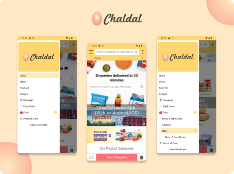

<div id="top"></div>
<!-- PROJECT LOGO -->
<br />
<div align="center">

  <a href="https://github.com/OmarFaruk-0x01/ChalDal" >
    
  </a>

## **ChalDal**

  <p align="center">
    ChalDal is a online e-commerce shop of Bangladesh. This app is a Android Version of the ChalDal.com website. 
    <br />
    <div>
  
      
</div>
    <a href="https://github.com/OmarFaruk-0x01/ChalDals/issues">Report Bug</a>
    ·
    <a href="https://github.com/OmarFaruk-0x01/ChalDals/issues">Request Feature</a>
  </p>

</div>

<!-- TABLE OF CONTENTS -->
<details open >
  <summary style="cursor: pointer;">Table of Contents</summary>
  <ol>
    <li>
      <a href="#about-the-project">About The Project</a>
      <ul>
        <li><a href="#features-with-snapshots">Features with Snapshots</a></li>
        <li><a href="#built-with">Built With</a></li>
      </ul>
    </li>
        <li><a href="#prerequisites">Prerequisites</a></li>
    <li>
      <a href="#installation">Installation</a>
    </li>
    <li>
      <a href="#setup_run">Setup & Run</a>
    </li>
  </ol>
</details>

<!-- ABOUT THE PROJECT -->

## About The Project

<div align="center">

</div><br>
ChalDal App is a Android & IOS version of [chaldal.com](https://chaldal.com). It is made by React Native and Web View.

<p align="right">(<a href="#top">back to top</a>)</p>

## Features with Snapshots

1. Whole website in one view.
   <details ><summary>snapshot</summary>

    

   </details>

2. Custom Navigation Bar.
   <details ><summary>snapshot</summary>

   

   </details>

3. Recursive Category List
   <details ><summary>snapshot</summary>

   

   </details>

## Built With

#### Frontend Technology

- [React Native](https://reactnative.dev/)
- [React Native WebView]()

<p align="right">(<a href="#top">back to top</a>)</p>

## Prerequisites

There are some prerequisites to run this app and server

- **NPM**

  Follow the instruction to install [node-js & npm](https://nodejs.org/de/download/package-manager/)

######

- **Python3**
  <details>
  <summary>Linux</summary>

  ```sh
  sudo apt-get install python3
  sudo apt-get instsll python3-pip
  ```

  </details>
  <details>
  <summary >MacOS</summary>

  ```sh
  brew instsll python3 python3-pip
  ```

  </details>
  <details>
  <summary>Windows</summary>
  Download Python Binary by <a href="https://www.python.org/ftp/python/3.10.4/python-3.10.4-amd64.exe" download>clicking here</a> 
  </details>

#####

- **React Native**

  React native has a greate [documentation](https://reactnative.dev/docs/environment-setup) for enviroment setup

## Installation

### Frontend

1. Clone the repo
   ```sh
   git clone https://github.com/OmarFaruk-0x01/ChalDals
   ```
2. Install NPM packages
   ```sh
   npm install
   ```
3. Run the command to start application.
   ```sh
   npx react-native run-android
   npx react-native start
   ```

<p align="right">(<a href="#top">back to top</a>)</p>

<!-- Setup Projects -->
<div id="setup_run"></div>

## Setup & Run

Now you have to run some commands to start the app.

### Frontend

1. To run the application
   ```sh
   cd Frontend
   npx react-native run-android # 'run-ios' if you are in macOS
   ```
2. To start the development server
   ```sh
   npx react-native start
   ```
3. To make a Release Build follow [the article][release_build_article].

<p align="right">(<a href="#top">back to top</a>)</p>

<!-- [stars-url]: https://github.com/github_username/repo_name/stargazers
[issues-url]: https://github.com/github_username/repo_name/issues
[linkedin-shield]: https://img.shields.io/badge/-LinkedIn-black.svg?style=for-the-badge&logo=linkedin&colorB=555 -->

[linkedin-url]: https://linkedin.com/in/linkedin_username
[ps1]: Screenshots/EBR1.jpg
[ps2]: Screenshots/EBR2.jpg
[ps3]: Screenshots/EBR3.jpg
[ps4]: Screenshots/EBR4.jpg
[release_build_article]: https://instamobile.io/android-development/generate-react-native-release-build-android/
[ngrok_url]: https://ngrok.com/
[eduresultgov]: http://www.educationboardresults.gov.bd/
